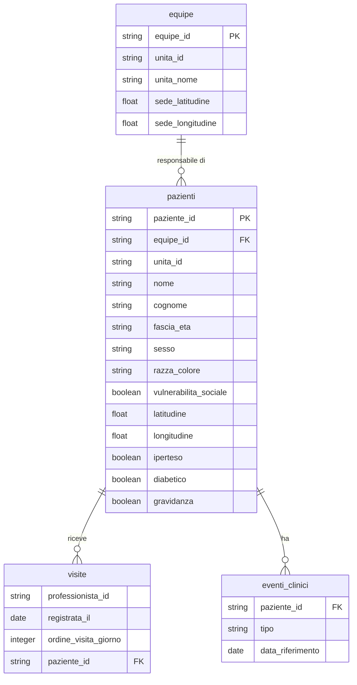

# 🏥 Claude Impact Lab 2026 | Dataset Salute di Rio

---

> ### 🇮🇹 Nota
>
> Questo è un **adattamento leggero** della sfida originale del Claude Impact Lab
> Rio de Janeiro 2026 (Anthropic + Prefeitura do Rio de Janeiro). Il **contesto
> brasiliano è mantenuto** — ACS, UBS, SUS, Rio — ma rispetto al dataset originale
> della Prefeitura sono cambiate tre cose, per renderlo utilizzabile in questa
> presentazione:
>
> 1. **Colonne tradotte in italiano** (nell'originale erano in portoghese);
> 2. **Nomi sintetici aggiunti** a ogni paziente (nell'originale erano anonimizzati);
> 3. **Coordinate GPS riposizionate nella Favela da Rocinha**, attorno alla
>    *Clínica da Família Maria do Socorro Silva e Souza* (`-22.9893451, -43.255015`).
>
> I **dati clinici reali** (ipertensione, diabete, gravidanza, vulnerabilità,
> eventi, visite) e le loro relazioni sono **preservati** dal dataset anonimizzato
> reale. I termini brasiliani sono spiegati nel
> [glossario](#-glossario-per-il-pubblico-italiano) in fondo.

---

> ### ⚠️ **Avviso importante**
>
> I dati originali sono passati attraverso un rigoroso **processo di
> anonimizzazione** (randomizzazione, generalizzazione, soppressione), e questo
> adattamento aggiunge nomi sintetici e riposiziona le coordinate.
>
> **Gli indicatori generati a partire dai dati NON rappresentano la realtà.**
> I dati illustrano soltanto le dinamiche del sistema sanitario.

---

## 📊 Accesso rapido ai dati

| 🗂️ **Tabella** | 📝 **Descrizione** | 🔗 **File** |
|:---------------|:-------------------|:------------|
| **Pazienti** | Le anagrafiche di migliaia di pazienti, con nome e condizioni cliniche | [📥 pazienti.parquet](assets/parquet/pazienti.parquet) |
| **Eventi Clinici** | Le visite specialistiche prenotate (via *regulação*, da comunicare ai pazienti) e gli accessi in pronto soccorso o ricoveri (che indicano necessità di contatto più stretto) | [📥 eventi_clinici.parquet](assets/parquet/eventi_clinici.parquet) |
| **Visite degli ACS** | Lo storico delle visite degli Agenti Comunitari di Salute | [📥 visite.parquet](assets/parquet/visite.parquet) |
| **Équipe di Salute** | L'elenco delle équipe e delle unità (UBS), con la localizzazione della sede in Rocinha | [📥 equipe.parquet](assets/parquet/equipe.parquet) |

> I dati sono inclusi nella repo in formato **Parquet**, pronti per Claude Code.
> In `assets/anteprima/` trovi un campione in CSV (prime 200 righe) di ogni
> tabella, per dare un'occhiata veloce al contenuto.

---

## 📚 Materiali di supporto

*(Documenti originali della sfida di Rio, in portoghese)*

- 📖 [Manual do Agente Comunitário de Saúde (Ministério da Saúde)](http://189.28.128.100/dab/docs/publicacoes/geral/manual_acs.pdf)
- 📗 [Guia Prático do ACS](http://189.28.128.100/dab/docs/publicacoes/geral/guia_acs.pdf)
- 🏛️ [Repositório Principal do Município (SUBPAV)](https://bibliotecasus.subpav.org/)
- 👥 [Cartilha do Agente Comunitário (2014)](https://subpav.org/aps/uploads/publico/repositorio/cartilha-do-agente-comunitario-2014.pdf)

---

## 🎯 La Sfida

## Intelligenza nel Territorio — Ottimizzare la pianificazione delle visite domiciliari degli Agenti Comunitari di Salute

### Il lavoro degli Agenti Comunitari di Salute (ACS)

* Rio ha **6.200 Agenti Comunitari di Salute (ACS)** responsabili di visitare attivamente **4,5 milioni di residenti**.
* Queste visite avvengono soprattutto nei territori più vulnerabili della città: le *favelas*. **La zona di questa sfida è la Rocinha**, la più grande favela del Brasile (~100.000 abitanti su un versante di ~1 km²).
* Oggi la pianificazione delle visite quotidiane dipende ancora molto da:
    * la memoria degli agenti;
    * la carta;
    * la conoscenza informale del territorio.
* Allo stesso tempo, dati clinici e sociali rilevanti restano dispersi e poco utilizzati nei sistemi delle cure primarie.
* La sfida è trasformare questi dati in una risposta pratica e unica ogni mattina:
    * chi visitare;
    * in quale ordine;
    * per quale motivo;
    * sulla base del rischio reale e delle lacune di cura.

### Cosa succede se lo risolviamo

* La presenza quotidiana nel territorio diventa più mirata.
* La cura diventa più preventiva e meno reattiva.
* Le famiglie ad alto rischio vengono raggiunte più rapidamente.
* Le condizioni rilevabili possono essere identificate prima.
* Emergenze e ricoveri evitabili tendono a diminuire.

### Chi beneficia della soluzione

* Direttamente:
    * i **6.200 ACS**, con una giornata di lavoro più chiara, sicura e prioritizzata;
    * i **residenti** seguiti, che vengono visti prima e con maggiore frequenza quando serve.
* Indirettamente:
    * le équipe delle cliniche, che ricevono casi meglio prioritizzati;
    * il sistema sanitario municipale, che può ridurre le emergenze evitabili.

### Com'è fatto il successo

* Ogni ACS inizia la giornata con una lista affidabile di visite basata sul rischio.
* Le famiglie ad alto rischio vengono raggiunte in giorni, non in settimane.
* Agenti ed équipe cliniche restano sincronizzati in tempo reale.
* La città inizia a registrare più famiglie visitate per turno e meno emergenze evitabili.

---

## 📘 Dizionario dei dati

### Modello dei dati

### equipe.parquet
Anagrafica delle équipe di salute e delle loro sedi (UBS) in Rocinha. *(49 righe)*

| Colonna | Tipo | Descrizione |
|---------|------|-------------|
| `equipe_id` | string | Identificativo univoco dell'équipe (hash) |
| `unita_id` | string | Identificativo dell'unità di salute — UBS (hash) |
| `unita_nome` | string | Nome dell'UBS. L'unità principale è la *Clínica da Família Maria do Socorro Silva e Souza* |
| `sede_latitudine` | float | Latitudine dell'UBS. Gli ACS partono sempre da qui. |
| `sede_longitudine` | float | Longitudine dell'UBS. Gli ACS partono sempre da qui. |

### eventi_clinici.parquet
Registro degli eventi clinici dei pazienti. *(100.503 righe)*

| Colonna | Tipo | Descrizione |
|---------|------|-------------|
| `paziente_id` | string | Identificativo univoco del paziente (hash) |
| `tipo` | string | `visita-specialistica-prenotata` = appuntamento da comunicare al paziente; `accesso-ps-o-ricovero` = accesso in urgenza/emergenza o ricovero |
| `data_riferimento` | date | Data di riferimento dell'evento (YYYY-MM-DD) |

### pazienti.parquet
Anagrafica completa dei pazienti con informazioni demografiche e cliniche. *(97.938 righe)*

| Colonna | Tipo | Descrizione |
|---------|------|-------------|
| `paziente_id` | string | Identificativo univoco del paziente (hash) |
| `equipe_id` | string | Identificativo dell'équipe responsabile (hash) |
| `unita_id` | string | Identificativo dell'unità di salute — UBS (hash) |
| `nome` | string | Nome del paziente *(sintetico)* |
| `cognome` | string | Cognome del paziente *(sintetico)* |
| `fascia_eta` | string | Fascia d'età (`0-6`, `6-18`, `19-45`, `45-65`, `66+`) |
| `sesso` | string | `Femminile` / `Maschile` |
| `razza_colore` | string | `Bianca` / `Nera` / `Parda` / `Altro` — categoria del censimento brasiliano (IBGE); *Parda* = di carnagione mista |
| `vulnerabilita_sociale` | boolean | Indica se il paziente è in situazione di vulnerabilità sociale |
| `latitudine` | float | Latitudine dell'indirizzo del paziente (in Rocinha) |
| `longitudine` | float | Longitudine dell'indirizzo del paziente (in Rocinha) |
| `iperteso` | boolean | Indica se il paziente è iperteso |
| `diabetico` | boolean | Indica se il paziente è diabetico |
| `gravidanza` | boolean | Indica se la paziente è in gravidanza |

### visite.parquet
Registro delle visite effettuate dai professionisti di salute (ACS). *(159.599 righe)*

| Colonna | Tipo | Descrizione |
|---------|------|-------------|
| `professionista_id` | string | Identificativo univoco del professionista/ACS (hash) |
| `registrata_il` | date | Data in cui la visita è stata registrata (YYYY-MM-DD) |
| `ordine_visita_giorno` | integer | Ordine sequenziale della visita nella giornata |
| `paziente_id` | string | Identificativo del paziente visitato (hash) |

---

## 📋 Schede di rilevazione territoriale

Le schede sono i **moduli che l'operatore compila a domicilio** durante la visita:
strumenti di raccolta strutturata, adattamento italiano delle *fichas* SMS-Rio/SUBPAV.
I file JSON descrivono la struttura di ogni scheda (sezioni, campi, tipi ed
enumerazioni) e si trovano in [`assets/schede/`](assets/schede/).

| Scheda | Destinatario | Frequenza | File |
|:-------|:-------------|:----------|:-----|
| **A — Anagrafica del Nucleo Familiare** | Tutti i nuclei presi in carico | Alla presa in carico, poi aggiornamento annuale | [scheda_a_anagrafica_famiglia.json](assets/schede/scheda_a_anagrafica_famiglia.json) |
| **B — Follow-up Patologia Cronica** | Assistiti ipertesi, diabetici, BPCO/asma o anziani fragili | Mensile (quindicinale se scompensato) | [scheda_b_cronico.json](assets/schede/scheda_b_cronico.json) |
| **B — Accompagnamento della Gravidanza** | Donne in gravidanza in carico | Mensile fino alla 32ª settimana, poi quindicinale | [scheda_b_gravidanza.json](assets/schede/scheda_b_gravidanza.json) |
| **C — Prima Infanzia (0-6 anni)** | Bambini 0-6 anni nei nuclei in carico | Mensile nel primo anno, poi trimestrale | [scheda_c_prima_infanzia.json](assets/schede/scheda_c_prima_infanzia.json) |

> I blocchi comuni a tutte le schede (intestazione, identificazione dell'assistito,
> esito della visita) e le enumerazioni condivise sono in
> [`_shared.json`](assets/schede/_shared.json), a cui le singole schede fanno
> riferimento tramite `shared_ref`.

---

## 🏆 Sfide bonus
Hai finito tutto e vuoi di più?

- **Per la gestione:** costruire visualizzazioni utili ai responsabili delle unità, o al gestore dell'*área programática* (il distretto sanitario di Rio).
- **Per l'ACS:** individuare lacune di cura e miglioramenti nei follow-up che permettano risposte più rapide (o meno reattive).

---

## 🇧🇷 Glossario per il pubblico italiano

Termini brasiliani mantenuti nella sfida, con l'equivalente o la spiegazione italiana:

| Termine (BR) | Cosa significa |
|--------------|----------------|
| **ACS** — Agente Comunitário de Saúde | Operatore sanitario di comunità, **assunto dal quartiere in cui vive**. Non è un infermiere: è il ponte tra la clinica e le famiglie del territorio. Non esiste una figura identica in Italia (la più vicina è l'Infermiere di Famiglia e di Comunità, ma con formazione clinica). |
| **Rocinha** | La più grande *favela* del Brasile, sul versante tra São Conrado e Gávea a Rio. ~100.000 abitanti. La zona di questa sfida. |
| **Clínica da Família Maria do Socorro** | L'UBS (unità di cure primarie) reale che ancora la nostra mappa. Da qui partono le équipe ogni mattina. |
| **SUS** — Sistema Único de Saúde | Il servizio sanitario pubblico e universale brasiliano — l'equivalente del nostro **SSN**. |
| **UBS** — Unidade Básica de Saúde / **Clínica da Família** | La struttura delle cure primarie sul territorio, dove ha sede l'équipe. Equivale grosso modo alla **Casa della Comunità**. |
| **Atenção Primária** | Cure primarie / assistenza territoriale. |
| **Regulação** | Il sistema pubblico che assegna e prenota le visite specialistiche. Gli appuntamenti "via regulação" sono quelli che l'ACS deve **comunicare** al paziente. |
| **SMS-Rio / SUBPAV** | La Secretaria Municipal de Saúde di Rio e la sua sottosegreteria per le cure primarie — l'amministrazione che ha fornito i dati. |
| **Favela** | Insediamento urbano informale, i **territori più vulnerabili** dove si concentra il lavoro degli ACS. |
| **Área Programática (AP)** | La suddivisione territoriale della sanità di Rio, simile a un **distretto sanitario**. |
| **Raça/cor (IBGE)** | Categoria del censimento brasiliano (Bianca, Nera, Parda…). In Italia il dato "razza/colore" **non** viene raccolto in sanità: qui è parte del contesto brasiliano. |

---

## 🔒 Processo di anonimizzazione e adattamento

I dati originali della Prefeitura sono anonimizzati con: hash crittografico (SHA256),
campionamento (2.000 pazienti per équipe), *date shifting*, rumore geografico
(~100m), randomizzazione degli indirizzi, generalizzazione (fasce d'età, razza/colore)
e soppressione dei record rari (k-anonymity <5).

**Questo adattamento** aggiunge sopra: traduzione delle colonne in italiano, nomi
sintetici deterministici per paziente, e riposizionamento di tutte le coordinate
dentro la Rocinha (le coordinate originali erano già randomizzate, quindi il loro
riposizionamento non altera alcun dato reale). I flag clinici, gli eventi e le
visite restano quelli del dataset reale.

**Cosa NON rappresenta la realtà:** indicatori assoluti, localizzazione precisa,
popolazione totale, date esatte, nomi. **Cosa è preservato:** la sequenza temporale
degli eventi, le relazioni tra tabelle, le prevalenze cliniche e i principali pattern
di comportamento.

### 📚 Riferimenti tecnici

| Metodologia | Link |
|:------------|:-----|
| 🏥 **HIPAA Safe Harbor Method** | [Documentazione](https://www.hhs.gov/hipaa/for-professionals/privacy/special-topics/de-identification/index.html) |
| 🔐 **Differential Privacy** | [Wikipedia](https://en.wikipedia.org/wiki/Differential_privacy) |
| 🛡️ **K-Anonymity** | [Wikipedia](https://en.wikipedia.org/wiki/K-anonymity) |

---

**AI Build Midweek** · Product Heroes · 22 luglio 2026
*Adattamento italiano della sfida del Claude Impact Lab Rio 2026.
Progetto vincitore: [Visitare](https://github.com/Visitare/visitare) — team ACS Digital.*

