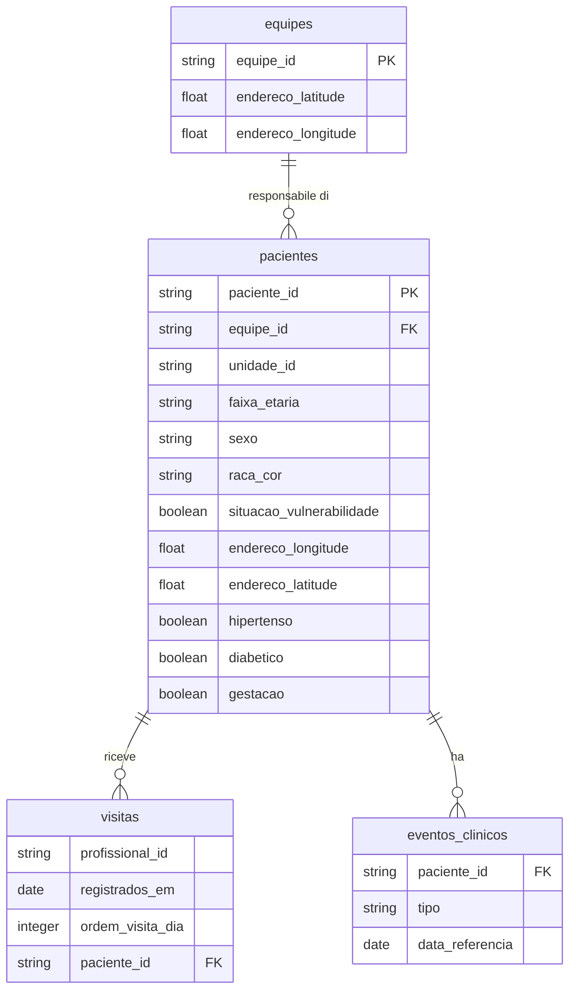

# 🏥 Claude Impact Lab 2026 | Dataset Salute di Rio

---

> ### 🇮🇹 Nota del traduttore
>
> Questa è la **traduzione italiana della sfida originale** del Claude Impact Lab
> Rio de Janeiro 2026 (Anthropic + Prefeitura do Rio de Janeiro). Il contesto,
> i termini e i dati brasiliani sono **mantenuti come nell'originale**: si parla
> di ACS, UBS, SUS, favelas, del Rio de Janeiro reale. Non è un adattamento
> all'Italia — è la sfida vera, così com'è stata consegnata ai partecipanti,
> resa leggibile in italiano. I termini brasiliani sono spiegati nel
> [glossario](#-glossario-per-il-pubblico-italiano) in fondo.

---

> ### ⚠️ **Avviso importante**
>
> Tutti i dati della sfida sono passati attraverso un rigoroso **processo di
> anonimizzazione**, con tecniche di randomizzazione, generalizzazione e
> soppressione.
>
> **Gli indicatori generati a partire dai dati NON rappresentano la realtà.**
> I dati illustrano soltanto le dinamiche del sistema sanitario.
>
> 📖 Per approfondire il processo di anonimizzazione, vedi la [sezione dedicata](#-processo-di-anonimizzazione) in fondo al documento.

---

## 📊 Accesso rapido ai dati

| 🗂️ **Tabella** | 📝 **Descrizione** | 🔗 **File (PARQUET)** |
|:---------------|:-------------------|:----------------------|
| **Anagrafica Pazienti** | Le anagrafiche di migliaia di pazienti | [📥 pacientes.parquet](assets/parquet/pacientes.parquet) |
| **Eventi Clinici** | Le visite prenotate (via *regulação*, che devono essere comunicate ai pazienti) e gli accessi in unità di urgenza, emergenza e ospedali (che indicano la necessità di un contatto più stretto) | [📥 eventos_clinicos.parquet](assets/parquet/eventos_clinicos.parquet) |
| **Visite degli ACS** | Lo storico delle visite degli Agenti Comunitari di Salute | [📥 visitas.parquet](assets/parquet/visitas.parquet) |
| **Équipe di Salute** | L'elenco delle équipe e delle unità, con la localizzazione della sede | [📥 equipes.parquet](assets/parquet/equipes.parquet) |

> I dati sono già inclusi in questa repo (formato Parquet), pronti per essere
> esplorati con Claude Code. Nella sfida originale erano distribuiti via link.

---

## 📚 Materiali di supporto

*(Documenti originali della sfida di Rio, in portoghese)*

- 📖 [Manual do Agente Comunitário de Saúde (Ministério da Saúde)](http://189.28.128.100/dab/docs/publicacoes/geral/manual_acs.pdf)
- 📗 [Guia Prático do ACS](http://189.28.128.100/dab/docs/publicacoes/geral/guia_acs.pdf)
- 🏛️ [Repositório Principal do Município (SUBPAV)](https://bibliotecasus.subpav.org/)
- 🚨 [Violências e Papel dos ACS](https://subpav.org/aps/uploads/publico/repositorio/SMS_ViolenciasPapelACS_A5_v2.pdf)
- 👥 [Cartilha do Agente Comunitário (2014)](https://subpav.org/aps/uploads/publico/repositorio/cartilha-do-agente-comunitario-2014.pdf)

---

## 🎯 La Sfida

## Intelligenza nel Territorio — Ottimizzare la pianificazione delle visite domiciliari degli Agenti Comunitari di Salute

### Il lavoro degli Agenti Comunitari di Salute (ACS)

* Rio ha **6.200 Agenti Comunitari di Salute (ACS)** responsabili di visitare attivamente **4,5 milioni di residenti**.
* Queste visite avvengono soprattutto nei territori più vulnerabili della città (le *favelas*).
* Oggi la pianificazione delle visite quotidiane dipende ancora molto da:
    * la memoria degli agenti;
    * la carta;
    * la conoscenza informale del territorio.
* Allo stesso tempo, dati clinici e sociali rilevanti restano dispersi e poco utilizzati nei sistemi delle cure primarie.
* La sfida è trasformare questi dati in una risposta pratica e unica ogni mattina:
    * chi visitare;
    * in quale ordine;
    * per quale motivo;
    * sulla base del rischio reale e delle lacune di cura.

### Cosa succede se lo risolviamo

* La presenza quotidiana nel territorio diventa più mirata.
* La cura diventa più preventiva e meno reattiva.
* Le famiglie ad alto rischio vengono raggiunte più rapidamente.
* Le condizioni rilevabili possono essere identificate prima.
* Emergenze e ricoveri evitabili tendono a diminuire in città.

### Chi beneficia della soluzione

* Direttamente:
    * i **6.200 ACS**, con una giornata di lavoro più chiara, sicura e prioritizzata;
    * i **4,5 milioni di residenti** seguiti, che vengono visti prima e con maggiore frequenza quando serve.
* Indirettamente:
    * le équipe delle cliniche, che ricevono casi meglio prioritizzati;
    * il sistema sanitario municipale, che può ridurre le emergenze evitabili.

### Com'è fatto il successo

* Ogni ACS inizia la giornata con una lista affidabile di visite basata sul rischio.
* La lista è creata dalla soluzione sviluppata dai partecipanti dell'Impact Lab.
* Le famiglie ad alto rischio vengono raggiunte in giorni, non in settimane.
* Agenti ed équipe cliniche restano sincronizzati in tempo reale.
* La città inizia a registrare:
    * più famiglie visitate per turno;
    * meno emergenze evitabili.

---

## 📘 Dizionario dei dati

### Modello dei dati

> **Nota:** i nomi delle colonne sono in portoghese, come nel dataset originale.
> Le descrizioni qui sotto sono tradotte in italiano.

### equipes.parquet
Anagrafica delle équipe di salute e delle loro localizzazioni. *(49 righe)*

| Colonna | Tipo | Descrizione |
|---------|------|-------------|
| `equipe_id` | string | Identificativo univoco dell'équipe (hash) |
| `endereco_latitude` | float | Latitudine dell'unità di salute (UBS) a cui l'équipe appartiene. Gli ACS partono sempre da qui. |
| `endereco_longitude` | float | Longitudine dell'unità di salute a cui l'équipe appartiene. Gli ACS partono sempre da qui. |

### eventos_clinicos.parquet
Registro degli eventi clinici dei pazienti. *(100.503 righe)*

| Colonna | Tipo | Descrizione |
|---------|------|-------------|
| `paciente_id` | string | Identificativo univoco del paziente (hash) |
| `tipo` | string | Tipo di evento clinico. `agendamento` = visita specialistica prenotata (da comunicare al paziente); `urgencia-emergencia-ou-internacao` = accesso in urgenza/emergenza o ricovero |
| `data_referencia` | date | Data di riferimento dell'evento (formato: YYYY-MM-DD) |

### pacientes.parquet
Anagrafica completa dei pazienti con informazioni demografiche e cliniche. *(97.938 righe)*

| Colonna | Tipo | Descrizione |
|---------|------|-------------|
| `paciente_id` | string | Identificativo univoco del paziente (hash) |
| `equipe_id` | string | Identificativo dell'équipe responsabile (hash) |
| `unidade_id` | string | Identificativo dell'unità di salute — UBS (hash) |
| `faixa_etaria` | string | Fascia d'età del paziente (es: `0-6`, `19-45`, `66+`) |
| `sexo` | string | Sesso del paziente (`Masculino`/`Feminino`) |
| `raca_cor` | string | Razza/colore dichiarata (`Branca`/`Preta`/`Parda`/`Outros`) — categoria del censimento brasiliano (IBGE) |
| `situacao_vulnerabilidade` | boolean | Indica se il paziente è in situazione di vulnerabilità sociale |
| `endereco_longitude` | float | Longitudine dell'indirizzo del paziente |
| `endereco_latitude` | float | Latitudine dell'indirizzo del paziente |
| `hipertenso` | boolean | Indica se il paziente è iperteso |
| `diabetico` | boolean | Indica se il paziente è diabetico |
| `gestacao` | boolean | Indica se la paziente è in gravidanza |

### visitas.parquet
Registro delle visite effettuate dai professionisti di salute (ACS). *(159.599 righe)*

| Colonna | Tipo | Descrizione |
|---------|------|-------------|
| `profissional_id` | string | Identificativo univoco del professionista/ACS (hash) |
| `registrados_em` | date | Data in cui la visita è stata registrata (formato: YYYY-MM-DD) |
| `ordem_visita_dia` | integer | Ordine sequenziale della visita nella giornata |
| `paciente_id` | string | Identificativo del paziente visitato (hash) |

---

## 🏆 Sfide bonus
Hai finito tutto e vuoi di più?

- **Per la gestione:** costruire visualizzazioni utili ai responsabili delle unità, o al gestore dell'*área programática* (il distretto sanitario di Rio).
- **Per l'ACS:** individuare lacune di cura e miglioramenti nei follow-up che permettano risposte più rapide (o meno reattive).

---

## 🇧🇷 Glossario per il pubblico italiano

Termini brasiliani mantenuti nella sfida, con l'equivalente o la spiegazione italiana:

| Termine (BR) | Cosa significa |
|--------------|----------------|
| **ACS** — Agente Comunitário de Saúde | Operatore sanitario di comunità, **assunto dal quartiere in cui vive**. Non è un infermiere: è il ponte tra la clinica e le famiglie del territorio. Non esiste una figura identica in Italia (la più vicina è l'Infermiere di Famiglia e di Comunità, ma con formazione clinica). |
| **SUS** — Sistema Único de Saúde | Il servizio sanitario pubblico e universale brasiliano — l'equivalente del nostro **SSN**. |
| **UBS** — Unidade Básica de Saúde / **Clínica da Família** | La struttura delle cure primarie sul territorio, dove ha sede l'équipe. Equivale grosso modo alla **Casa della Comunità**. È il punto da cui gli ACS partono ogni mattina. |
| **Atenção Primária** | Cure primarie / assistenza territoriale. |
| **Regulação** | Il sistema pubblico che assegna e prenota le visite specialistiche. Le "consultas agendadas via regulação" sono appuntamenti che l'ACS deve **comunicare** al paziente. |
| **Vitacare** | La cartella clinica elettronica usata nelle cure primarie di Rio. |
| **SMS-Rio / SUBPAV** | La Secretaria Municipal de Saúde di Rio e la sua sottosegreteria per le cure primarie — l'amministrazione che ha fornito i dati. |
| **Favela** | Insediamento urbano informale, i **territori più vulnerabili** dove si concentra il lavoro degli ACS. |
| **Área Programática (AP)** | La suddivisione territoriale della sanità di Rio, simile a un **distretto sanitario**. |
| **Raça/cor (IBGE)** | Categoria del censimento brasiliano (Branca, Preta, Parda…). In Italia il dato "razza/colore" **non** viene raccolto in sanità: qui è parte del contesto brasiliano. |

---

## 🔒 Processo di anonimizzazione

I dati sono anonimizzati sommando una serie di tecniche per robustezza e sicurezza:

| 🔧 Tecnica | 📝 Descrizione |
|:-----------|:---------------|
| 🔐 **Hash crittografico (SHA256)** | Generazione di chiave artificiale per collegare le tabelle via hash SHA256 con secret |
| 📊 **Campionamento anagrafico** | Campione di 2.000 pazienti per équipe. Le équipe con meno pazienti sono state soppresse |
| 📅 **Date shifting** | Spostamento casuale dei giorni (varia per paziente, mantiene l'ordine sequenziale) |
| 📍 **Anonimizzazione geografica** | Aggiunta di fino a **100m di rumore** casuale alle coordinate |
| 🏠 **Randomizzazione degli indirizzi** | Rimescolamento degli indirizzi mantenendo la logica territoriale dell'équipe |
| 📈 **Generalizzazione e aggregazione** | Fasce d'età, categorie di razza/colore, aggregazione temporale |
| 🚫 **Soppressioni** | Rimozione di procedure rare (<1000) e record con k-anonymity <5 |

### ⚠️ Impatti dell'anonimizzazione

**❌ Cosa NON rappresenta la realtà:** indicatori assoluti, mappatura territoriale esatta, localizzazione precisa, popolazione totale, date esatte degli eventi.

**✅ Cosa è preservato:** la sequenza temporale degli eventi, la logica territoriale (con rumore), le dinamiche del sistema, le relazioni tra tabelle, i principali pattern di comportamento.

### 📚 Riferimenti tecnici

| Metodologia | Link |
|:------------|:-----|
| 🏥 **HIPAA Safe Harbor Method** | [Documentazione](https://www.hhs.gov/hipaa/for-professionals/privacy/special-topics/de-identification/index.html) |
| 🔐 **Differential Privacy** | [Wikipedia](https://en.wikipedia.org/wiki/Differential_privacy) |
| 🛡️ **K-Anonymity** | [Wikipedia](https://en.wikipedia.org/wiki/K-anonymity) |

---

**AI Build Midweek** · Product Heroes · 22 luglio 2026
*Traduzione italiana della sfida del Claude Impact Lab Rio 2026.
Progetto vincitore: [Visitare](https://github.com/Visitare/visitare) — team ACS Digital.*

